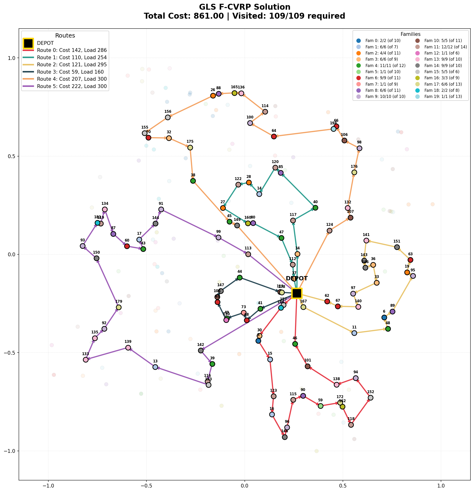

# Guided Local Search for Family-CVRP

A Python implementation of **Guided Local Search (GLS)** for solving the **Family Capacitated Vehicle Routing Problem (F-CVRP)**.



## 📋 Problem Description

The **Family-CVRP** is a variant of the classic Vehicle Routing Problem where:
- Customers are grouped into **families**
- Each family has a **required number of visits** (not all members need to be visited)
- The solver must select which family members to visit to satisfy requirements
- All vehicle capacity constraints must be respected

### Instance Characteristics
| Parameter | Value |
|-----------|-------|
| Customers | 200 |
| Families | 20 |
| Required Visits | 109 |
| Vehicle Capacity | 300 |
| Vehicles | 6 |

## 🚀 Features

- **Guided Local Search (GLS)** metaheuristic with penalty-based diversification
- **Multiple neighborhood operators**: Relocation, Swap, 2-Opt, FamilySwap
- **Penalty Reset mechanism** for intensification around promising solutions
- **Variable Neighborhood Descent (VND)** for final solution polishing
- **Solution visualization** with MDS-projected coordinates
- **Solution verification** with detailed feasibility checks

## 📁 Project Structure

```
├── Solver_gls.py          # Main GLS solver implementation
├── F_CVRP_Model.py        # Problem model and data structures
├── main_gls.py            # Entry point for running the solver
├── visualization.py       # Route visualization with matplotlib
├── instance.txt           # Problem instance data
└── requirements.txt       # Python dependencies
```

## 🔧 Installation

```bash
# Clone the repository
git clone https://github.com/rigosanastasios-bit/gls-fcvrp.git
cd gls-fcvrp

# Install dependencies
pip install -r requirements.txt
```

## 📦 Requirements

- Python 3.8+
- NumPy
- Matplotlib
- Scikit-learn

## ▶️ Usage

### Run the solver
```bash
python main_gls.py
```

## ⚙️ Algorithm Parameters

| Parameter | Default | Description |
|-----------|---------|-------------|
| `penalty_weight` | 0.03 | λ - Controls penalty strength in GLS |
| `max_iterations` | 25,000 | Maximum GLS iterations |
| `random_seed` | 2 | Seed for reproducibility |
| `k_neighbors` | 40 | Neighbors checked in FamilySwap |

## 🧠 Algorithm Overview

### Guided Local Search (GLS)

GLS is a metaheuristic that escapes local optima by penalizing frequently-used solution features (edges/arcs). The algorithm:

1. **Constructs** an initial solution using Nearest Neighbor heuristic
2. **Improves** via local search operators (Relocation, Swap, 2-Opt, FamilySwap)
3. **Penalizes** costly arcs when stuck in local optima
4. **Resets** penalties when finding new best solutions (intensification)
5. **Polishes** the final solution with VND

### Penalty Mechanism

For each arc $(i,j)$:
$$Cost_{penalized}(i,j) = Cost(i,j) \times (1 + \lambda \times penalties(i,j))$$

When no improving move exists, the arc with highest utility is penalized:
$$utility(i,j) = \frac{Cost(i,j)}{1 + penalties(i,j)}$$

## 📊 Results

The solver achieves a solution cost of **861.00** within ~12,000 iterations.

### Sample Output
```
Initial solution cost: 1235.00
Iter 11740: New best = 861.00
Running final VND intensification...
Final solution cost: 861.00
```

##  Author

Anastasios Rigos

## 🔗 References

- Voudouris, C., & Tsang, E. (1999). Guided local search and its application to the traveling salesman problem.
- Mendoza, J. E., et al. (2010). A memetic algorithm for the multi-compartment vehicle routing problem with stochastic demands.
